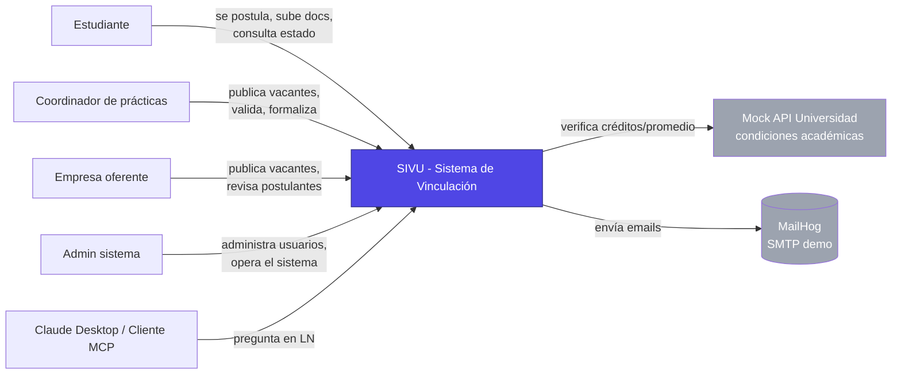
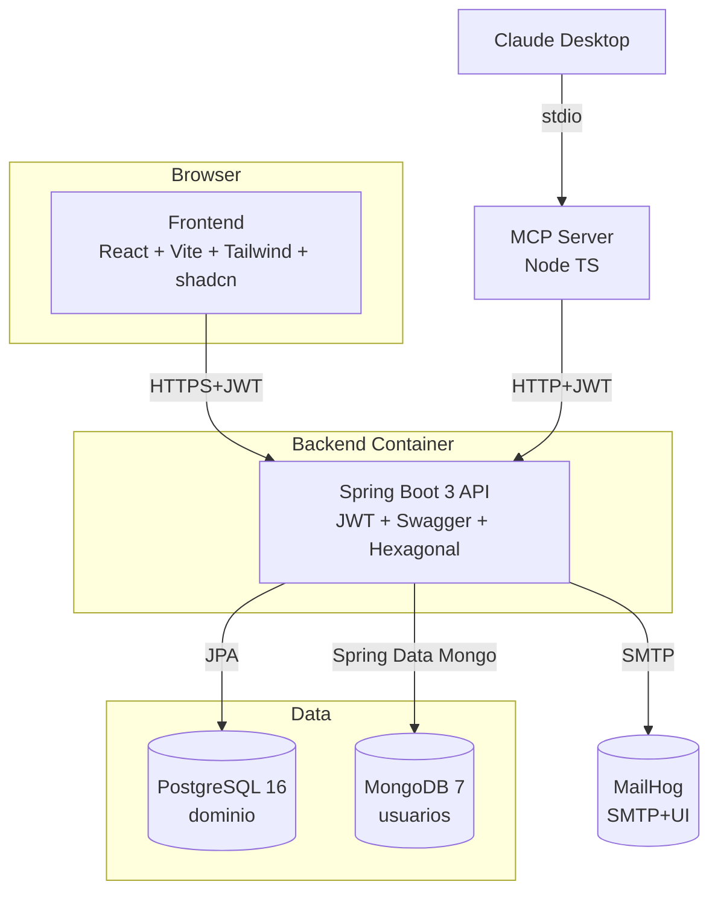
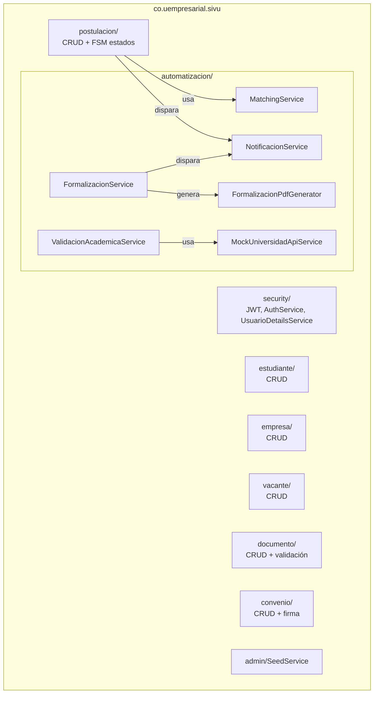
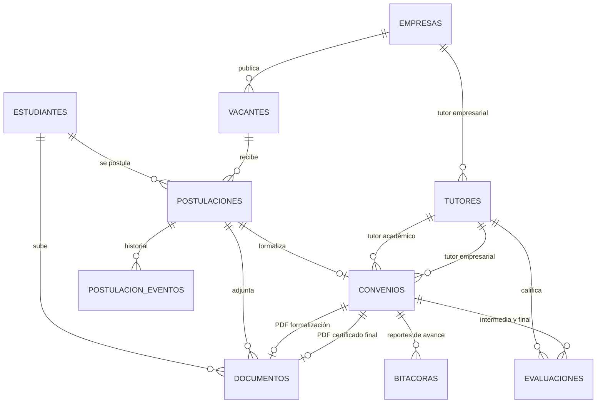
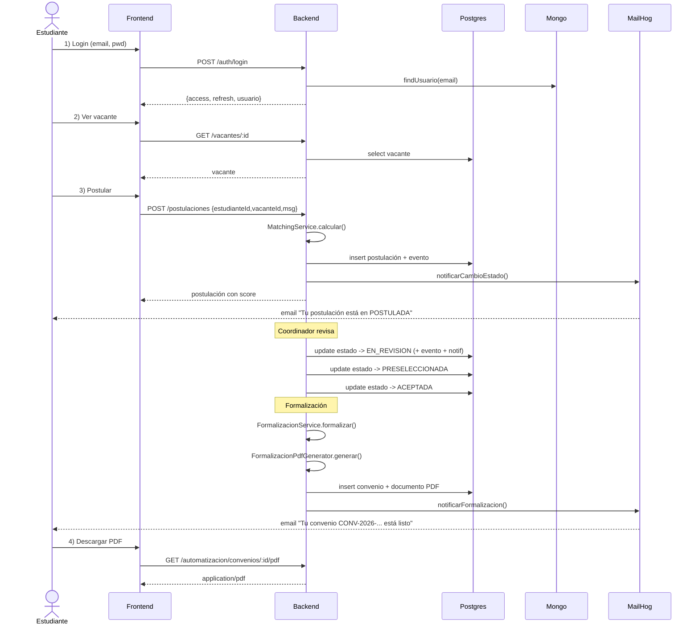
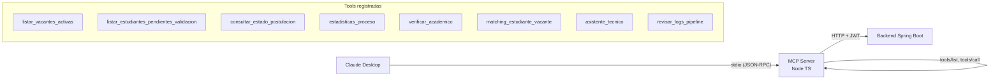

# Arquitectura de SIVU

Documento técnico de arquitectura para **SIVU — Sistema de Vinculación Universitaria**, proyecto final de Despliegue Continuo. Versión 1.0 (mayo 2026).

## Contenido

- [1. Contexto del problema](#1-contexto-del-problema)
- [2. Decisiones arquitectónicas (ADRs)](#2-decisiones-arquitectónicas-adrs)
- [3. Diagramas C4](#3-diagramas-c4)
- [4. Modelo de datos](#4-modelo-de-datos)
- [5. Flujo principal end-to-end](#5-flujo-principal-end-to-end)
- [6. Seguridad](#6-seguridad)
- [7. Automatizaciones](#7-automatizaciones)
- [8. Integración MCP](#8-integración-mcp)
- [9. Despliegue local](#9-despliegue-local)
- [10. Trazabilidad con requerimientos](#10-trazabilidad-con-requerimientos)

---

## 1. Contexto del problema

La universidad ofrece **3 prácticas profesionales de 6 meses** a sus pregrados. El proceso actual (AS-IS, ver [`/proyecto_kelly_doc/Análisis proceso de vinculación.docx`](../../../proyecto_kelly_doc/)) presenta cinco cuellos de botella:

1. Carga manual de documentos por correo.
2. Verificación humana repetitiva de condiciones académicas.
3. Correos de seguimiento redactados a mano.
4. Correcciones del documento de formalización por errores de captura.
5. Nula visibilidad para el estudiante sobre el estado de su trámite.

SIVU automatiza el proceso completo: portal de carga con validación, verificación académica vía API, matching automático con score, generación de PDF de formalización, notificaciones en cada cambio de estado y un agente MCP para consultas en lenguaje natural.

---

## 2. Decisiones arquitectónicas (ADRs)

### ADR-001 — Spring Boot 3 + Java 21 en el backend
**Contexto:** el enunciado lista Spring Boot, NestJS, Django y Node+Express como opciones válidas.
**Decisión:** Spring Boot 3.3 + Java 21.
**Razones:** stack maduro empresarial, ecosistema completo (Security, Data, Validation), arquitectura hexagonal natural, JPA limpio sobre Postgres.
**Consecuencias:** mayor consumo de memoria que Node, pero mejor para representar un sistema empresarial real.

### ADR-002 — PostgreSQL para el core, MongoDB para usuarios
**Contexto:** el enunciado exige "PostgreSQL para el Core de la Api, pero los usuarios deben ser gestionados con otra base de datos en otra tecnología".
**Decisión:** PostgreSQL 16 (relacional) para entidades de dominio + MongoDB 7 (documental) para la colección `usuarios` (auth, perfil, roles).
**Razones:** contraste claro de tecnologías; Mongo brinda flexibilidad para campos opcionales de perfil y futuras extensiones (preferencias, sesiones); no hay integridad referencial cross-DB porque el `usuarioId` desde Postgres no es necesario y los `estudianteId`/`empresaId` desde Mongo son enlaces lógicos opcionales.
**Consecuencias:** dos data sources en Spring; auditoría JPA para Postgres + auditoría Mongo separada.

### ADR-003 — Package-by-feature con persistencia JPA directa (NO hexagonal estricto)
**Decisión:** un paquete Java por dominio (`estudiante/`, `empresa/`, `vacante/`, etc.), cada uno con sub-paquetes `domain/`, `persistence/`, `service/`, `web/`. Las entidades del paquete `domain/` son entidades JPA (`@Entity`, `@Table`, `@ManyToOne`); el `service/` inyecta el `Repository` (Spring Data) directamente.
**Razones:** facilita encontrar todo lo relacionado a un agregado en un solo lugar; reduce ceremonia (sin mappers domain↔jpa cross-aggregate); el `Repository` de Spring Data ya actúa como puerto para queries declarativas.
**Alternativa descartada — hexagonal estricto:** se evaluó separar dominio puro (POJO) + puerto + adaptador JPA. Implicaba ~50 archivos nuevos, mappers cross-aggregate (Convenio referencia 5 entidades: Estudiante, Empresa, Vacante, Postulacion, Documento, Tutor x2), y riesgo alto de regresiones. Para un dominio que NO va a cambiar de infraestructura, la inversión no se justifica.
**Consecuencias:** el "dominio" está acoplado a JPA. Si en el futuro hiciera falta soportar otra fuente de datos (eventos, NoSQL para parte del dominio), habría que refactorizar a hexagonal en ese momento.

### ADR-004 — React + Vite + TS + Tailwind + shadcn/ui en el frontend
**Decisión:** SPA con React 18, Vite, TypeScript estricto, TailwindCSS y componentes shadcn/ui.
**Razones:** look empresarial inmediato sin reinventar componentes; TanStack Query y Zustand cubren server state y client state sin Redux; build rápido con Vite.

### ADR-005 — MCP en lugar de IA convencional (punto 8 del enunciado)
**Contexto:** el enunciado pide elegir entre Punto 7 (IA convencional: recomendador, chatbot, etc.) y Punto 8 (MCP).
**Decisión:** servidor MCP en Node TS con `@modelcontextprotocol/sdk`, expone herramientas que consultan el backend SIVU.
**Razones:** MCP es estándar abierto, demuestra integración real con herramientas externas, y se conecta a Claude Desktop sin entrenamiento de modelo propio.

### ADR-006 — CI/CD con GitHub Actions y demo local con Docker Compose
**Decisión:** pipeline en GitHub Actions con jobs `backend → frontend → mcp → api-contract → e2e → docker`. La "etapa de despliegue" en alcance académico es `docker-compose up` en local (decisión [[feedback-prod-boundary]] del usuario: prod fuera de scope).
**Razones:** GH Actions es gratis para repos públicos y el docente puede revisar las ejecuciones; docker-compose es reproducible en cualquier máquina del jurado.

---

## 3. Diagramas C4

### Nivel 1 — Contexto



### Nivel 2 — Contenedores



### Nivel 3 — Componentes del backend



---

## 4. Modelo de datos

### PostgreSQL — `sivu` (dominio)



Detalle de columnas en [`/backend/src/main/resources/db/migration/V1__init_schema.sql`](../../backend/src/main/resources/db/migration/V1__init_schema.sql).

### MongoDB — `sivu_users`

Colección `usuarios`:
```json
{
  "_id": "...",
  "email": "kelly@u.edu.co",
  "passwordHash": "$2a$...",
  "nombres": "Kelly",
  "apellidos": "Delgado",
  "roles": ["ESTUDIANTE"],
  "estudianteId": 1,
  "empresaId": null,
  "activo": true,
  "ultimoLogin": "2026-05-17T...",
  "createdAt": "...",
  "updatedAt": "..."
}
```

Índices: `{ email: 1 }` único.

---

## 5. Flujo principal end-to-end



---

## 6. Seguridad

- **Autenticación:** JWT firmados HS512, secret de mínimo 64 bytes. `accessToken` 60 min, `refreshToken` 7 días.
- **Autorización:** roles `ADMIN`, `COORDINADOR`, `ESTUDIANTE`, `EMPRESA`, `MCP_AGENT`. Control declarativo con `@PreAuthorize` por endpoint.
- **Hash de contraseñas:** BCrypt con factor 12.
- **CORS:** restringido a localhost en dev (`http://localhost:*`), configurable por entorno.
- **CSRF:** desactivado por ser API stateless + JWT.
- **Filtro:** `JwtAuthenticationFilter` único antes de `UsernamePasswordAuthenticationFilter`, no toca rutas públicas (`/auth/login`, `/auth/register`, `/auth/refresh`, `/admin/seed`, `/swagger-ui/**`, `/v3/api-docs/**`, `/actuator/health`).

---

## 7. Automatizaciones

| Automatización | Trigger | Servicio | Output |
|---|---|---|---|
| **Cálculo de score** | Crear postulación | `MatchingService.calcular(est, vac)` | `{score, recomendado, justificacion}` |
| **Verificación académica** | Endpoint `/validar-academico/{id}` | `ValidacionAcademicaService` → `MockUniversidadApiService` | `{cumple, motivo}` |
| **Notificación email** | Cambio de estado de postulación, validación de doc, formalización, certificado emitido | `NotificacionService` (`@Async`) → JavaMailSender → MailHog | Email visible en MailHog UI |
| **Generación PDF formalización** | `POST /automatizacion/formalizar/{postulacionId}` | `FormalizacionService` → `FormalizacionPdfGenerator` (OpenPDF) | PDF persistido + Documento + Convenio |
| **Cronograma del estudiante** | Cualquier cambio de estado | `PostulacionEventoRepository.save()` | Timeline visible en `/postulaciones/{id}/historial` |
| **Promedio de evaluaciones + sugerida** | `GET /evaluaciones/resumen/{convenioId}` | `EvaluacionService.resumenPorConvenio()` | Promedios + `calificacionFinalSugerida` (50/50 ACADEMICO/EMPRESARIAL) |
| **Generación certificado final PDF** | `POST /automatizacion/certificado/{convenioId}` (solo si convenio FINALIZADO + calificación) | `CertificadoService` → `CertificadoPdfGenerator` (OpenPDF horizontal) | PDF persistido + Documento tipo CERTIFICADO + email automático al estudiante |

Detalle del algoritmo de matching:

| Componente | Puntos máx | Cálculo |
|---|---:|---|
| Créditos cumplidos | 25 | binario |
| Promedio cumplido | 15 | binario |
| Programa dirigido | 10 | binario |
| Match keywords (TF) | 50 | proporcional al % de keywords de la vacante presentes en el perfil textual del estudiante |
| **Total** | **100** | umbral recomendación: 70 (configurable) |

---

## 8. Integración MCP



Pregunta soportada: *"¿Qué estudiantes están pendientes de validación esta semana?"* → el cliente MCP invoca `listar_estudiantes_pendientes_validacion` y responde con datos reales.

---

## 9. Despliegue local

Ver [`docs/ejecutar-local.md`](../ejecutar-local.md) para el paso a paso. En resumen: `cp .env.example .env && make demo`.

Topología local:

```
host:5173  ──► sivu-frontend (nginx)
host:8080  ──► sivu-backend (Spring Boot)
host:5432  ──► sivu-postgres
host:27017 ──► sivu-mongo
host:1025  ──► sivu-mailhog (SMTP)
host:8025  ──► sivu-mailhog (UI)
```

---

## 10. Trazabilidad con requerimientos

Mapa completo en [`docs/scrum/trazabilidad.md`](../scrum/trazabilidad.md). Aquí los hitos más relevantes:

| Requerimiento del enunciado | Implementación SIVU |
|---|---|
| **Backend completo** | `backend/` Spring Boot 3, 7 controladores REST, 92 archivos Java |
| **Frontend completo** | `frontend/` React + Vite + Tailwind + shadcn/ui |
| **Arquitectura documentada** | Este documento (`docs/arquitectura/README.md`) |
| **API REST** | Spring Boot + springdoc-openapi → Swagger UI en `/swagger-ui.html` |
| **Mínimo 6 CRUD** (en realidad 9 que cubren el flujo al 100 %) | Estudiante, Empresa, Vacante, Postulación, Documento, Convenio, **Tutor**, **Bitácora**, **Evaluación** |
| **Etapa "durante" la práctica** | Bitácora (reportes de avance con revisión por tutores), Evaluación (intermedia y final por ambos tutores con promedios + sugerida) |
| **Etapa "cierre" de la práctica** | Convenio.finalizar(calificacionFinal) → CERTIFICADO PDF emitido + email automático |
| **Autenticación** | JWT + roles + `@PreAuthorize` |
| **Validaciones** | Bean Validation en DTOs + reglas en `*Service` |
| **Lógica de negocio significativa** | Matching, FSM de postulación, formalización con PDF |
| **Manejo de errores** | `GlobalExceptionHandler` + `ApiError` |
| **Swagger** | `/swagger-ui.html` + `/v3/api-docs` |
| **PostgreSQL core + otra BD** | Postgres 16 (dominio) + MongoDB 7 (usuarios) |
| **Pruebas unitarias ≥ 6** | 33 tests JUnit 5 + Mockito |
| **Pruebas API (Postman/Newman)** | `tests/postman/SIVU.postman_collection.json` + `tests/newman/run.sh` |
| **Pruebas funcionales (Cypress/Selenium)** | `tests/cypress/` |
| **Pruebas de rendimiento (k6/JMeter/Artillery)** | `tests/k6/` |
| **Calidad (SonarQube/SonarCloud)** | `sonar-project.properties` + job en `ci.yml` |
| **MCP (punto 8)** | `mcp-server/` con 8 tools |
| **CI/CD (NÚCLEO)** | `.github/workflows/ci.yml` con stages build→test→sonar→docker |
