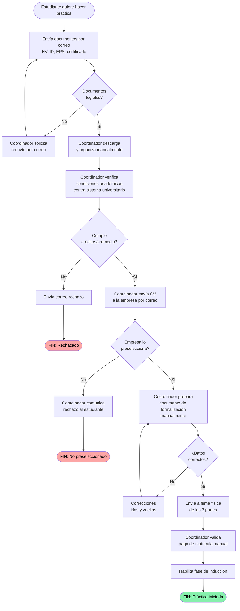

# Flujo AS-IS — Proceso actual de vinculación

Diagrama del proceso actual (manual) que SIVU automatiza. Reflejo en Mermaid del BPMN del archivo `Jaydeth trabajo }.bpm`.

**Cuellos de botella identificados** (ver `Análisis proceso de vinculación.docx`):

1. **Carga manual de documentos** → desorden, pérdida de tiempo.
2. **Verificación humana repetitiva** → escala mal con cientos de estudiantes.
3. **Flujo de correos ineficiente** → cada paso depende de redacción manual.
4. **Fricción en la formalización** → correcciones por errores de captura.
5. **Falta de visibilidad** → el estudiante no sabe en qué paso está su trámite.
