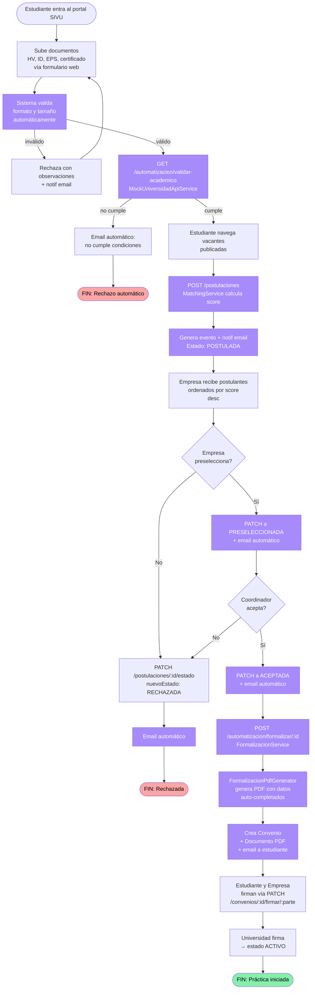

# Flujo TO-BE — Proceso automatizado con SIVU

Reflejo en Mermaid del BPMN `to be jaydeth (2).bpm`, **aterrizado a tecnologías locales** del proyecto académico (sin n8n + AWS).

> El TO-BE original proponía n8n + AWS Textract + Bedrock + SES + RDS. Por la restricción del proyecto (entrega solo local, ver [decisión arquitectónica](../arquitectura/README.md#adr-006)), SIVU implementa las mismas automatizaciones con:
>
> - **Textract → Validador local + parsing simple** (en futura iteración: integrar Tesseract/Apache PDFBox).
> - **Bedrock matching → MatchingService propio** (TF de keywords + reglas).
> - **SES → MailHog** en demo, JavaMailSender en producción.
> - **CloudHSM / DocuSign → Firma simulada** vía endpoint PATCH `/convenios/{id}/firmar/{parte}`.
> - **API académica → MockUniversidadApiService** (en producción: integrar el SIA real).

**Pasos automatizados** (en lila): de los 17 pasos del flujo, 11 son ejecutados automáticamente por SIVU. El estudiante ve el estado en tiempo real en su dashboard ("tipo seguimiento de pedido"), y un agente MCP permite a Coordinación responder preguntas como *"¿Qué estudiantes están en EN_REVISION desde hace más de 5 días?"*.
